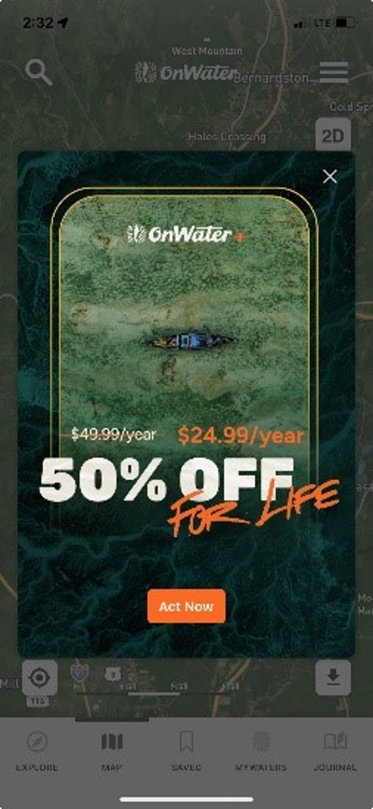

<style>

.hero {
  display: flex;
  flex-direction: column;
  align-items: center;
  font-family: var(--sans-serif);
  margin: 4rem 0 8rem;
  text-wrap: balance;
  text-align: center;
}

.hero h1 {
  margin: 2rem 0;
  max-width: none;
  font-size: 14vw;
  font-weight: 900;
  line-height: 1;
  background: linear-gradient(30deg, var(--theme-foreground-focus), currentColor);
  -webkit-background-clip: text;
  -webkit-text-fill-color: transparent;
  background-clip: text;
}

.hero h2 {
  margin: 0;
  max-width: 34em;
  font-size: 20px;
  font-style: initial;
  font-weight: 500;
  line-height: 1.5;
  color: var(--theme-foreground-muted);
}

@media (min-width: 640px) {
  .hero h1 {
    font-size: 90px;
  }
}

</style>

<div class="hero">
  <h1>TU/USGS imagery collaboration</h1>  
  <h2>This doucment is a guide to the imagery study in the Deerfield River watershed.</h2>
</div>

<hr>

Welcome to **TroutSpotter**! This tool gives anglers the power of Artificial Intelligence (AI) to identify individual fish from photos. It’s not only fun for you to have your catch uniquely identified, but that identity can help us understand things like how often fish get recaptured, how they move throughout a system, and even to estimate population sizes.  By participating in this community science effort that we are launching in four focal watersheds in 2024 (including the Deerfield), you can gain a deeper understanding of your home waters while helping advance a revolutionary new approach for fisheries management, science and conservation!

<hr>

## Get ready

Download [onWater](www.onwaterapp.com) on your phone.

1) Create your account and fill in your user profile
2) Allow 'location services' within the application
3) Make sure you turn on geolocation of images in the `settings` on your phone

<div class="tip" style="max-width: 740px;">

    On iPhone:  
      Settings -> Privacy and Security -> LocationServices -> Camera Application 

    On android:   
      Settings -> secutity and privacy -> permission manager -> location [allow] 
      Settings -> secutity and privacy -> permission manager -> camera [allow] 

</div>

 The service we need in onWater is FREE. Ignore option to pay to upgrade. (hit “x” in the top right corner in the image below) 


<hr>

<div class="note">
  Will add tabs to allow quick selection of each study location across the country.
</div>

## Map of the study areas in the Deerfield  
There are two regions of interest,  
  1) The Deerfield River **mainstem** from Carbis Bend to the Hoosic tunnel bridge.  
  2) **Blue lines**  
    a) Mill Brook, Charlemont along route 8a  
    b) Bear River, from the confluence with the Deerfield

Markers in the maps below represent beginning (green) and ends (red) of the study areas on each river.  

<div class="grid grid-cols-2">
  <div class="card">
    <h1> Mainstem </h1>
    ${display(div_map1)}
  </div>
  <div class="card">
    <h1> Blue lines </h1>
    ${display(div_map2)}
  </div>
</div>

<hr>

## Start fishing  
Either record the start time in the app or turn on the tracking function (note this will be used by us but kept as private information). This will help us understand how many fish are caught per hour.

Remember to record the end time when you are done fishin.

<hr>

## Fish capture
- Keep them wet and minimize handling. If your shot is out of the water, do not exceed 5 seconds out of water. 

- Make sure your hands are wet. 

- Use barbless hooks and rubberized (silicone) nets. 

- If water temp is above 68 F, please do not fish. 

- Record temperature and note the temperature in onWater 

- Record start and end times to add as an onWater journal entry. In the future, onWater may add this feature automatically and may add the GPS track for your fishing bout. 

<hr>

## Take an image
Two possibilities:
1. Take images and upload to onWater later 

2. Use onWater in journal mode and take the picture from within onWater. This is also good for taking notes and making sure you don't forget to upload images later :)

- *What*: take a picture of the **left** flank of the fish in the net. Only one photo angle is necessary, but extra images do not hurt. Extra images can also be of the right side of the fish, but we will only use the left flank for individual idntification.
 - *Where*: for now, fish randomly within study area, but it is also OK to include pictures from outside of the set study area (any fish picture from any stream is a helpful fish picture!). 

- *How*: try to minimize **glare** in the image as much as possible (you may need to remove polarized glasses – if you want you could also try a polarizing filter for your phone – we don’t know much about this, but there are filters available online...). Also, try to avoid dark images in **shadow**.  
Attempt to capture the full length of the fish and avoid thumbs and fingers in the shot. 

Add comments to note section in onWater.  
  Examples include:
  - relative flow rate  
  - water temperature 
  - air temperature 
  - the fly used
  - condition of the fish 
  - how hard it fought 
  - any scars? describe them 


 One possiblity if you really want to get the perfect image is to turn on forward-facing camera, start recording video and lift the fish into the frame. Images can be extracted later and uploaded to onWater. 

<hr>

## Upload the image
1. Use onWater in journal mode and take the picture from within onWater.  
You are done.

2. Take images and upload to onWater later  
From Matt: "I recommend taking the photo and then uploading into the app later when you are off the water. After you upload the photo the app will populate with weather and flow information if it is able.  
First step is to open the OnWater app. I hit the X on the upper right hand corner of any pop ups that are asking me to upgrade my membership so that it brings me to the home page which should be a map of your location.  
Next I select the Journal tab in the lower left corner of the app screen and then I select the camera icon and then select "image". This brings you to your camera roll where you can select the photo you want to upload. Once selected you will have the chance to fill in any details about the photo. Then select "Save" in the upper right hand corner. Afterwards you can re open the photo and see if any of the extra data has been populated."  

<hr>

## Verify identities
This is in progress. WildMe will provide probabilities of **individual identity** for each submitted image. Users will verify the identity based on angler's experience with the fish and the current image and based on the images for the verified identies of previously-caught fish.


```js
// Map1
  const lat1 = 42.658;
  const lon1 = -72.91;
  const mag1 = 13;

  const div_map1 = display(document.createElement("div"));
  div_map1.style = "height: 400px;";

  const map1 = L.map(div_map1)
    .setView([lat1, lon1], mag1);

  L.tileLayer(
      'https://{s}.tile.openstreetmap.org/{z}/{x}/{y}.png',   
      {
        attribution: '&copy; <a href="https://www.openstreetmap.org/copyright">OpenStreetMap</a> contributors'
      }
  )
  .addTo(map1);

  const basemaps1 = {
    USGS_hydro: L.tileLayer(
      'https://basemap.nationalmap.gov/arcgis/rest/services/USGSHydroCached/MapServer/tile/{z}/{y}/{x}',
      {
        attribution: '<a href="http://www.doi.gov">U.S. Department of the Interior</a> | <a href="http://www.usgs.gov">U.S. Geological Survey</a> | <a href="http://www.usgs.gov/laws/policies_notices.html">Policies</a>',
        maxZoom: 20
      }
    ),
    StreetView: L.tileLayer(
      'https://{s}.tile.openstreetmap.org/{z}/{x}/{y}.png',   
      {attribution: '&copy; <a href="https://www.openstreetmap.org/copyright">OpenStreetMap</a> contributors'}
    ),
    Topography: L.tileLayer.wms(
      'http://ows.mundialis.de/services/service?',   
      {layers: 'TOPO-WMS'}
    ),
    Places: L.tileLayer.wms(
      'http://ows.mundialis.de/services/service?', 
      {layers: 'OSM-Overlay-WMS'}
    ),
    USGS_USImagery: L.tileLayer(
      'https://basemap.nationalmap.gov/arcgis/rest/services/USGSImageryOnly/MapServer/tile/{z}/{y}/{x}',
      {
        maxZoom: 20,
        attribution:
        'Tiles courtesy of the <a href="https://usgs.gov/">U.S. Geological Survey</a>',
      }
    )
  };
  L.control.layers(basemaps1).addTo(map1);
  basemaps1.USGS_hydro.addTo(map1);
```

```js
  const markersBottom1 = [
    {
      position: [42.66866, -72.958674],
      popupText: 'Deerfield river-bottom'
    }
  ];

  const markersTop1 = [
    {
      position: [42.674221, -72.995143],
      popupText: 'Deerfield River-top'
    }
  ];

  // Add the markers to the map
  markersBottom1.forEach(function(marker) {
    L.marker(marker.position, { icon: brookTroutIconBottom })
      .addTo(map1)
      .bindPopup(marker.popupText);
  });

  markersTop1.forEach(function(marker) {
    L.marker(marker.position, { icon: brookTroutIconTop })
      .addTo(map1)
      .bindPopup(marker.popupText);
  });
 
  const popup1 = L.popup();

  function onMapClick1(e) {
      popup1
          .setLatLng(e.latlng)
          .setContent("You clicked the map at " + e.latlng.toString())
          .openOn(map1);
  }

  map1.on('click', onMapClick1);
```

```js
// Map2
  const lat2 = 42.59;
  const lon2 = -72.57;
  const mag2 = 11;

  const div_map2 = display(document.createElement("div"));
  div_map2.style = "height: 400px;";

  const map2 = L.map(div_map2)
    .setView([lat2, lon2], mag2);


  L.tileLayer(
      'https://{s}.tile.openstreetmap.org/{z}/{x}/{y}.png',   
      {
        attribution: '&copy; <a href="https://www.openstreetmap.org/copyright">OpenStreetMap</a> contributors'
      }
  )
  .addTo(map2);

  const basemaps2 = {
    USGS_hydro: L.tileLayer(
      'https://basemap.nationalmap.gov/arcgis/rest/services/USGSHydroCached/MapServer/tile/{z}/{y}/{x}',
      {
        attribution: '<a href="http://www.doi.gov">U.S. Department of the Interior</a> | <a href="http://www.usgs.gov">U.S. Geological Survey</a> | <a href="http://www.usgs.gov/laws/policies_notices.html">Policies</a>',
        maxZoom: 20
      }
    ),
    StreetView: L.tileLayer(
      'https://{s}.tile.openstreetmap.org/{z}/{x}/{y}.png',   
      {attribution: '&copy; <a href="https://www.openstreetmap.org/copyright">OpenStreetMap</a> contributors'}
    ),
    Topography: L.tileLayer.wms(
      'http://ows.mundialis.de/services/service?',   
      {layers: 'TOPO-WMS'}
    ),
    Places: L.tileLayer.wms(
      'http://ows.mundialis.de/services/service?', 
      {layers: 'OSM-Overlay-WMS'}
    ),
    USGS_USImagery: L.tileLayer(
      'https://basemap.nationalmap.gov/arcgis/rest/services/USGSImageryOnly/MapServer/tile/{z}/{y}/{x}',
      {
        maxZoom: 20,
        attribution:
        'Tiles courtesy of the <a href="https://usgs.gov/">U.S. Geological Survey</a>',
      }
    )
  };
  L.control.layers(basemaps2).addTo(map2);
  basemaps2.USGS_hydro.addTo(map2);
```

```js
    const markersBottom2 = [
      {
        position: [42.62599, -72.871978],
        popupText: 'Mill Brook-bottom'
      },
      {
        position: [42.562414, -72.699211],
        popupText: 'Bear River-bottom'
      }
    ];

    // Define the custom brook trout marker icon using SVG
    const brookTroutIconBottom = L.icon({
      iconUrl: 'https://raw.githubusercontent.com/pointhi/leaflet-color-markers/master/img/marker-icon-2x-green.png',
      iconSize: [28, 42],
      iconAnchor: [16, 42],
      popupAnchor: [0, -32]
    });

    // Add the markers to the map
    markersBottom2.forEach(function(marker) {
      L.marker(marker.position, { icon: brookTroutIconBottom })
        .addTo(map2)
        .bindPopup(marker.popupText);
    });


    const brookTroutIconTop = L.icon({
      iconUrl: 'https://raw.githubusercontent.com/pointhi/leaflet-color-markers/master/img/marker-icon-2x-red.png',
      iconSize: [28, 42],
      iconAnchor: [16, 42],
      popupAnchor: [0, -32]
    });

    const markersTop2 = [
      {
        position: [42.658304, -72.857469],
        popupText: 'Mill Brook-top'
      },
      {
        position: [42.537248, -72.752475],
        popupText: 'Bear River-top'
      }
    ];

    // Add the markers to the map
    markersTop2.forEach(function(marker) {
      L.marker(marker.position, { icon: brookTroutIconTop })
        .addTo(map2)
        .bindPopup(marker.popupText);
    });
 
const popup2 = L.popup();

function onMapClick2(e) {
    popup2
        .setLatLng(e.latlng)
        .setContent("You clicked the map at " + e.latlng.toString())
        .openOn(map2);
}

map2.on('click', onMapClick2);

```
